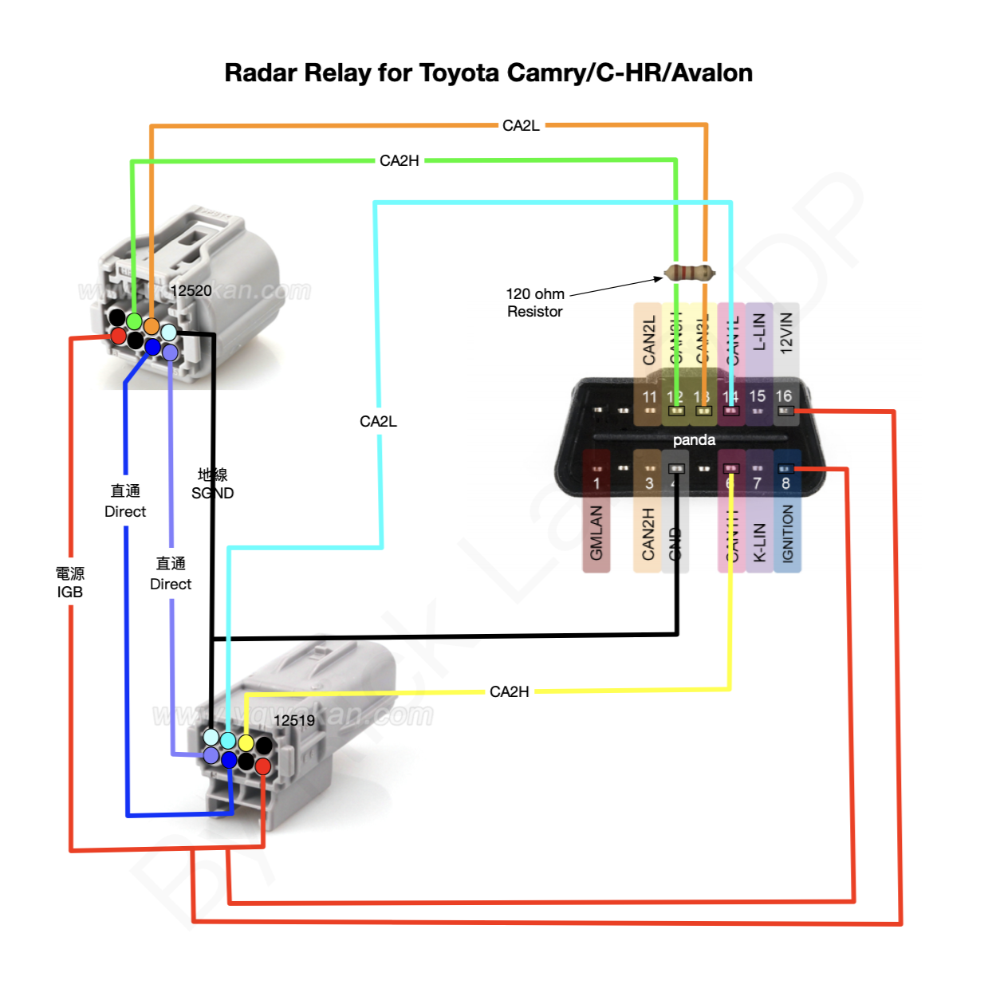
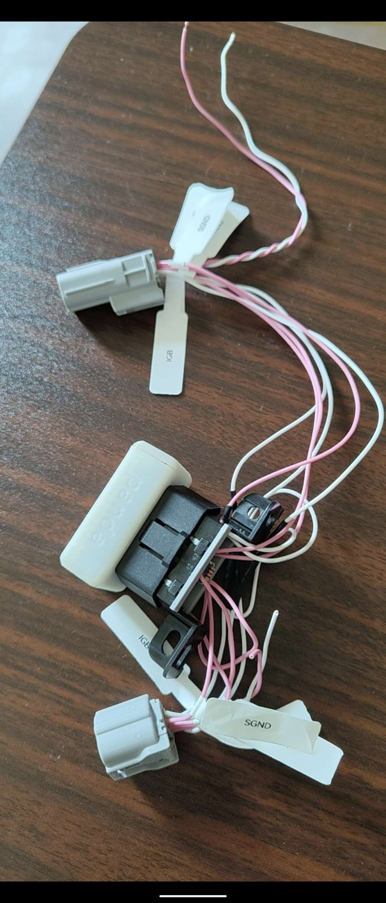

What is Radar ACC Filter?
------
For most of the Toyotas, longitudinal signal (0x343) can be intercepted through ADAS camera, however, there are some exceptions.

Radar ACC Filter (aka Radar Relay) is a CAN Filter that enables [openpilot](https://github.com/commaai/openpilot) longitudinal control on some Toyota vehicles such as Camry, C-HR, Avalon and some new 2022 RAV4.

[Eric Day](https://github.com/Smartype/) has developed a more advanced + cheaper approach called [canfilter](https://github.com/Smartype/canfilter/), however, it requires some extensive modification on openpilot.

This approach uses a spare [panda](https://github.com/commaai/panda) device I got at home with wocsor's [smart_dsu](https://github.com/wocsor/panda/tree/smart_dsu) firmware, works like a charm.

requirements
------
* a white [panda](https://github.com/commaai/panda), you can get it from [comma.ai](https://comma.ai/shop/panda) (grey panda is fine too).
* [SmartDSU firmware](https://github.com/wocsor/panda/tree/smart_dsu).
* [OBD-2 Female Connector](https://www.aliexpress.com/w/wholesale-obd2-female-connector.html)
* [12520 connector](https://www.aliexpress.com/w/wholesale-12520-connector.html)
* [12519 connector](https://www.aliexpress.com/w/wholesale-12519-connector.html)
* 120ohm resistor
* soldering tools

Diagram
------

Finished Product
------
